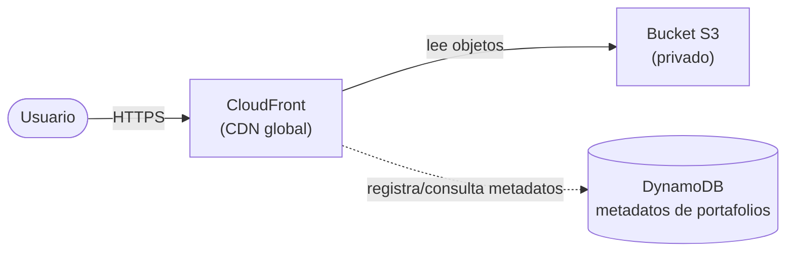

# Arquitectura — Plataforma de Portafolios Estudiantiles

> Plantilla para que documentes **tu** diseño. Complétala a medida que construyes tu stack de CDK.

---

## 1. Diagrama de arquitectura

_Este es un diagrama de referencia. Reemplázalo por el tuyo a medida que diseñas tu stack._

---

## 2. Componentes

| Componente | Servicio AWS | Responsabilidad | Decisiones de diseño |
|---|---|---|---|
| Almacenamiento | S3 | _¿Qué guarda? ¿Público o privado?_ | |
| CDN | CloudFront | _¿Cómo accede al bucket?_ | |
| Metadatos | DynamoDB | _¿Clave de partición? ¿Billing mode?_ | |
| Permisos | IAM | _¿Quién puede escribir/leer y por qué?_ | |

---

## 3. Seguridad y acceso

- ¿Cómo garantizas que el bucket **no** sea accesible directamente (403)?
- ¿Cómo accede CloudFront al bucket privado? (ej. OAC / OAI)
- ¿Qué permisos mínimos otorgaste en IAM?

_Completa aquí tu razonamiento._

---

## 4. Flujo de despliegue

- Lenguaje elegido para CDK: `______`
- Comando(s) para desplegar: `cdk deploy`
- Comando(s) para destruir: `cdk destroy`

---

## 5. Boss Fight (si lo abordaste)

- ¿Cómo manejaste los archivos **privados** (signed URLs)?
- ¿Qué **Price Class** configuraste y por qué?
- ¿Cómo conviven archivos públicos y privados en tu diseño?

_Completa aquí tu solución._
