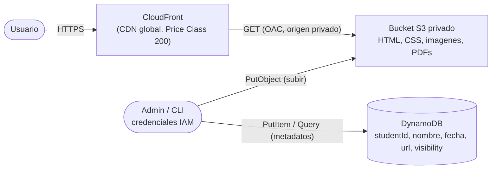

# Arquitectura — Plataforma de Portafolios Estudiantiles

> Plantilla para que documentes **tu** diseño. Complétala a medida que construyes tu stack de CDK.

---

## 1. Diagrama de arquitectura

_Este es un diagrama de referencia. Reemplázalo por el tuyo a medida que diseñas tu stack._

---

## 2. Componentes

| Componente | Servicio AWS | Responsabilidad | Decisiones de diseño |
|---|---|---|---|
| Almacenamiento | S3 | Archivos estaticos de cada portafolio | Privado, Block Public Access ON, autoDeleteObjets para destroy limpio segun vi por ahi |
| CDN | CloudFront | Sirve el contenido con baja latencia global | ORigen S3 via OAC, index.html como raiz, y con PriceClass 200 para Bossfight |
| Metadatos | DynamoDB | Registro consultable de portafolios | clave particion studentId, con pay_per_request, atributos de portafolios.json |
| Permisos | IAM | Quien sube a S3 y quien lee metadatos | Roles en el stack con minimo privilegio (s3: PutObject al bucket, dynamodb:GetIten/Query a la tabla) |

---

## 3. Seguridad y acceso

- si el usuario accede con la url del bucket -> 403, si el usuario accede con url del cloudfront -> 200. Block Public Acess y bucket policy que no permita lectura anonima.
- de cloudfront a s3 con OAC, cloudfront firma con su url y s3 solo acepta a esa url (firmas).
- siguiengo el minimo privilegio un rol para escribir solo en nuestro bucket, otro para ller solo en nuestra tabla, sin el * en recursos.

---

## 4. Flujo de despliegue

- Lenguaje elegido para CDK: `typescript`
- Comando(s) para desplegar: `cdk synth` luego `cdk deploy`
- Comando(s) para destruir: `cdk destroy`

---

## 5. Boss Fight (si lo abordaste)

- CloudFront Signed URLs por el KeyGroup + llave publica, aplicados a la ruta de privados/*.
- PRICE_CLASS_200 que cubre NA, EUR y ASIA (asi eran los requisitos).
- los archivos publicos se sirven normalmente, los privados/* si exigen una firma, sin romper el resto.

